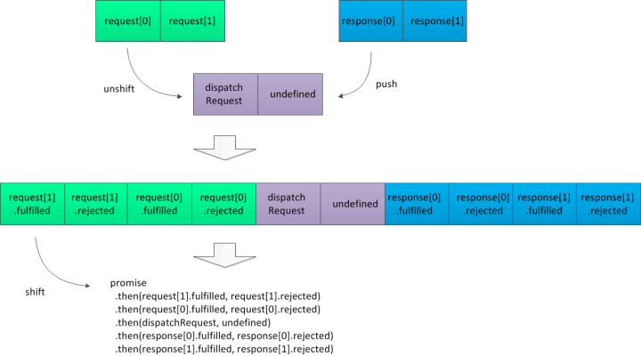

> [该项目对应的后端部分](https://github.com/AlexZhong22c/egg_cms-backend)

## 架构和预览

- [x] antd
- [x] ant-design/pro-layout
- [x] dva

npx umi dev

## 代码逻辑演示

**架构层面 演示：**

- 本地存储数据持久化层 @localStore文件夹
- axios拦截器中间件化 (分层解耦/插件化) @services文件夹
  - request 带上token
  - request 设置baseUrl
  - response 错误状态码500以上：弹窗提示
  - response 错误状态码500以下：通知提示
  - 断网的时候 只弹出1次弹窗提示
  - 请求超时的时候 只弹出1次弹窗提示
  - 服务器接口不存在 通知提示
  - (拦截器层的错误统一到一个rejected函数中处理)

**工程模块层面 演示：**

- react hooks
  - 用react hooks分离页内业务逻辑模块。
  - 封装公共hooks：封装 Modal 组件和逻辑；封装 Pagination 逻辑
  - (用hooks实现“带查询表单的分页表格增删改查”)
- redux-saga业务逻辑尽可能不使用try catch error

**api运用层面 演示：**

- 编辑一条记录的时候，载入到表单？ mapPropsToFields (antd)
- 如何拿到“在函数组件中的”组件实例？forwardRef useImperativeHandle (react)
- 在react组件外获取dva中的变量：`const token = window.g_app._store.getState().token;`

## axios拦截器中间件化

> 详见src/services文件夹：fulfilledHooks目录和rejectedHookOfAll.js文件。

axios拦截器分为请求拦截器和响应拦截器，要注册就是在对应的实例上调用use。每次use可以一起注册一个fulfilled函数和rejected函数，分别对应Promise语法的onResolve和onReject两类回调函数。

一般项目都是各use一次，而如果想更加深入地使用，可以解耦use多次。

拦截器等回调函数，通过axios构造函数内部逻辑的拼接可以等价为一个Promise式子：



```js
promise.
  // ......
  .then(req[1].fulfilled, req[1].rejected)
  .then(req[0].fulfilled, req[0].rejected)
  .then(dispatchRequest, undefined) // 正式去发起请求
  .then(res[0].fulfilled, res[0].rejected)
  .then(res[1].fulfilled, res[1].rejected)
  // ...... 直到业务端的axios(/**/).then的then中回调执行:
  .then(/**/, /**/)
```

### 拦截器层为什么应该只注册1个rejected钩子：

根据Promise的规则，一个错误会被最近的catch中的回调消费掉(catch是then的onRejected语法糖)。如果某个中间件要实现rejected，有可能会和上一个中间件抛出的错误相互耦合，而这样会导致很难处理好代码逻辑。

所以更好的做法是，在拦截器队列的最后放一个统一处理拦截器层错误的中间件：rejectedHookOfAll.js。

## React Hooks的使用：

##### 如何拿到useState最新的值

方法有很多。而在这里直接用`useRef`同步一份state。

参考src/hooks/useStateNewest.js。

##### 如何拿到“在函数组件中的”组件实例(forwardRef useImperativeHandle)

> 你需要通过 `forwardRef` 和 `useImperativeHandle` 的组合使用来实现在函数组件中正确拿到 form 实例。

[官方演示1](https://ant.design/components/form-cn/#%E5%A6%82%E4%BD%95%E5%9C%A8%E5%87%BD%E6%95%B0%E7%BB%84%E4%BB%B6%E4%B8%AD%E6%8B%BF%E5%88%B0-form-%E5%AE%9E%E4%BE%8B%EF%BC%9F)

[官方演示2](https://github.com/ant-design/ant-design/pull/19937/files/e22830985c025a4979239b42e46a12dc96b32b87#diff-c228e588c2e28d43fdccf78a6045206b)

##### 在第一页，删除一条记录的时候，想去重新获取第一页的列表 (用hooks useEffect的时候)

声明时，useEffect监听pager对象；处理事件时，需要获取列表的时候替换掉 pager 对象以触发监听回调。

## dva架构的使用

### redux-saga业务逻辑尽可能不使用try catch error

几乎所有saga的代码演示都是`强制要求`每个generator函数都try catch一次，这样显得代码异常难看。所以想办法在业务层saga函数这里不写try catch，在代码可维护性和可读性上都会产生可观的收益。

```js
  effects: {
    *setUserInfo({ payload }, { put }) {
      localStore.setUserInfo(payload);
      yield put({ type: 'set', payload });
    }
  }
```

services层：services层的错误应该抛到此层之外，也就是通常到业务层。这样业务层能够感知到错误，可以`选择去`做对应的错误处理，使得整个应用的交互是协调的。

业务层：在其他js体系下，本来业务层就是“可catch可不catch”的；但是在dva体系下，需要加onError，防止错误最终没有被catch而导致新js事件无法正常触发部分代码。(这个现象可能和dva的原理有关或者和redux-saga的原理有关，暂时没有细究为什么。)

在dva体系下，在src/app.js加上onError函数即可，整个应用就不会崩溃。

在dva体系下，对于整个应用的try catch的方法可以参考以下2个链接：

- [rootSaga try catch restart，这就类似于 某一个 woker 进程 挂了，自动重启一个新的 woker 进程一样](https://www.yuque.com/lovesueee/blog/redux-saga)
- [在架构上层try完之后，通过类似express.js的`const { err, callback } = fnCall(/**/)`的形式给出错误(不推荐此法)](https://github.com/dvajs/dva/issues/2097)
